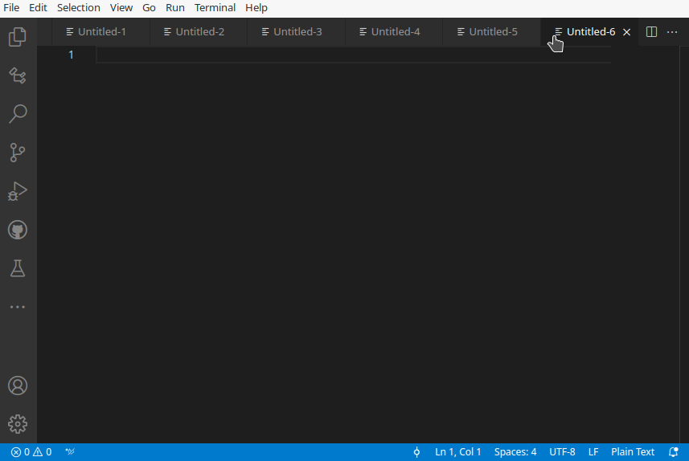
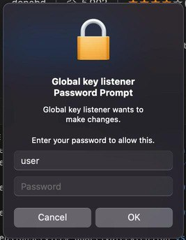
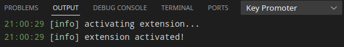
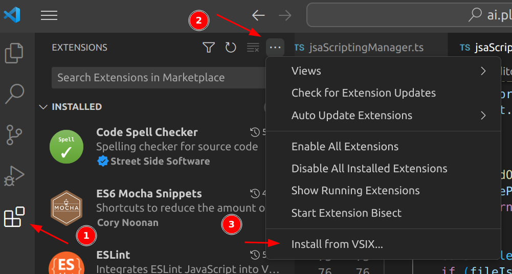

# Key Promoter

Extension that helps you to learn keyboard shortcuts while you are working. Now with **smart editor action detection** that learns from your editing patterns!

> **Note:** The current VSCode API does not allow the plugin to be implemented in full. Therefore, the plugin was implemented as a workaround and partially tracks user actions by indirect signs.

If you have any problems or want to participate in the development, welcome to the [project repository on GitHub](https://github.com/donebd/vscode-keypromoter).

## Privacy & Security Notice

- **100% Local Processing** - No data leaves your computer  
- **Open Source** - [Fully auditable code](https://github.com/donebd/vscode-keypromoter)  
- **No Telemetry** - Zero data collection  
- **In-Memory Only** - No logs written to disk  
- **Focus-Aware** - Automatically pauses when VS Code loses focus (only monitors within VS Code)

**[Read our Privacy Policy](PRIVACY.md)** | **No data collection** | **Local processing only**

> **For antivirus users:** This extension monitors keyboard events to suggest shortcuts. Some antivirus software may flag this as "keylogger-like" behavior, but the extension is completely safe and transparent. You can review the source code at any time.

## Features

### Command Shortcut Learning



* When you use the mouse on a button inside the editor, the extension shows you the keyboard shortcut that you should have used instead.

* For buttons that don't have a shortcut, the extension prompts you with the possibility to directly create one by opening the keybindings menu.

### Smart Editor Action Detection

Key Promoter now intelligently detects inefficient editing patterns and suggests better shortcuts:

#### Word & Line Deletion
- **Word Deletion** - Detects when you delete a word character-by-character instead of using `Ctrl+Backspace` / `Ctrl+Delete`
- **Line Deletion** - Detects when you press Backspace multiple times to delete an entire line instead of using `Ctrl+Shift+K`

#### Line Operations  
- **Line Movement** - Detects when you manually cut and paste to move lines instead of using `Alt+Up` / `Alt+Down`
- **Line Duplication** - Detects when you copy and paste to duplicate a line instead of using `Shift+Alt+Down`

#### Navigation Patterns
- **Arrow Navigation** - Detects excessive use of arrow keys when keyboard shortcuts would be faster:
  - Character-by-character word traversal → suggests `Ctrl+Left` / `Ctrl+Right`
  - Navigating to line start/end → suggests `Home` / `End`
  - Page scrolling with arrows → suggests `PageUp` / `PageDown`
  - File navigation with arrows → suggests `Ctrl+Home` / `Ctrl+End`

#### Text Selection
- **Inefficient Selection** - Detects slow text selection patterns:
  - Character-by-character word selection → suggests `Ctrl+Shift+Left` / `Ctrl+Shift+Right`
  - Word-by-word line edge selection → suggests `Shift+Home` / `Shift+End`

#### Multi-Cursor
- **Repeated Word Selection** - Detects when you repeatedly select the same word → suggests `Ctrl+D` for multi-cursor

> **Smart Learning:** The extension learns from your editing patterns and only shows suggestions after you've repeated the same inefficient action multiple times. It won't annoy you with one-time actions!

## Extension Settings

### Main Settings

|Setting|Description|Default|
|-|-|-|
|`Key Promoter.enabled`|**Enable/disable the extension completely**<br>Disables keyboard shortcut detection. [Read why this setting exists](https://github.com/donebd/vscode-keypromoter/blob/master/PRIVACY.md)|`true`|
|`Key Promoter.loyaltyLevel`|Number of command repetitions before showing notification|`5`|
|`Key Promoter.suggestKeybindingCreation`|Suggest creating custom shortcuts for commands without them|`true`|
|`Key Promoter.logger.loggingLevel`|Logging level for troubleshooting<br>Options: `Error`, `Warn`, `Info`, `Debug`|`"Info"`|

### Editor Action Detection Settings

|Setting|Description|Default|
|-|-|-|
|`Key Promoter.editorActions.enabled`|**Enable/disable smart editor action detection**<br>Detects inefficient editing patterns and suggests better shortcuts|`true`|
|`Key Promoter.editorActions.loyaltyLevel`|Number of inefficient action repetitions before showing notification|`1`|

> **Note:** Editor actions have a separate, lower loyalty level (default: 1) because they represent complete patterns (like deleting an entire line), not individual command executions. The extension won't spam you - it still tracks the pattern multiple times internally before showing a notification.

### Ignored Commands

|Setting|Description|Default|
|-|-|-|
|`Key Promoter.ignoredCommands`|Commands and patterns that will not trigger notifications<br>**Supports wildcards** (e.g., `"inlineChat.*"`)|`["type"]`|

#### Using Wildcards in Ignored Commands

You can use wildcards to ignore entire groups of commands or editor patterns:

```json
{
  "Key Promoter.ignoredCommands": [
    "type",
    
    // Ignore command groups
    "inlineChat.*",                    // Ignores all inlineChat commands
    "workbench.action.terminal.*",     // Ignores all terminal actions
    "git.*",                           // Ignores all git commands
    "editor.action.*",                 // Ignores all editor actions
    "workbench.action.Editor",         // Ignores tab navigation group
    
    // Ignore specific editor patterns
    "editorPattern.line-delete-backspace",      // Ignore line deletion tips
    "editorPattern.word-delete-backspace",      // Ignore word deletion tips
    "editorPattern.arrow-navigation-excessive", // Ignore arrow navigation tips
    
    // Ignore all editor patterns
    "editorPattern.*"                  // Ignores all editor action tips
  ]
}
```

**Editor Pattern IDs:**
- `editorPattern.line-delete-backspace` - Line deletion with Backspace
- `editorPattern.word-delete-backspace` - Word deletion character-by-character
- `editorPattern.line-movement-manual` - Manual line movement
- `editorPattern.line-duplication-manual` - Manual line duplication
- `editorPattern.word-selection-repeated` - Repeated word selection
- `editorPattern.arrow-navigation-excessive` - Excessive arrow key navigation
- `editorPattern.text-selection-navigation` - Inefficient text selection

## Platform Support

### Fully Supported
- ✅ **Windows** - Full support
- ✅ **macOS** - Full support (with permissions, see below)
- ✅ **Linux (X11)** - Full support

### Limited Support
- ⚠️ **Linux (Wayland)** - May have issues with keyboard monitoring
- ⚠️ **WSL** - May have incorrect behavior

### macOS Permissions

On macOS, you need to grant accessibility permissions:

1. Open **System Preferences** → **Security & Privacy** → **Privacy** → **Accessibility**
2. Add VS Code to the allowed applications
3. Restart VS Code



## How It Works

1. Monitors when you execute commands via mouse/menu or your editing patterns
2. Checks if the command has a keyboard shortcut
3. Shows your personalized shortcut after repeated usage

## Known Limitations

* Some default editor actions are not tracked
* Other extensions' commands are not supported  
* May have issues on Linux Wayland
* WSL may have incorrect behavior
* Mouse selection patterns are not detected (by design, to avoid false positives)

## Troubleshooting

### Viewing Logs

Use the **Key Promoter** output panel to see detailed logs:

1. Open Output panel: `View` → `Output`
2. Select "Key Promoter" from the dropdown
3. Adjust log level in settings if needed




### Testing Keyboard Detection

If you're unsure whether Key Promoter can detect your keyboard:

1. Open Command Palette (`F1`)
2. Run: `Key Promoter: Test Keyboard`
3. Press some keys to verify they are detected

This is useful for debugging platform-specific issues (especially on Linux Wayland or macOS without permissions).

### Common Issues

#### Extension not working
- Check that `Key Promoter.enabled` is `true`
- On macOS: verify accessibility permissions are granted
- Check the output panel for errors

#### Too many notifications
- Increase `Key Promoter.loyaltyLevel` for command notifications
- Increase `Key Promoter.editorActions.loyaltyLevel` for editor pattern notifications
- Add specific commands/patterns to `Key Promoter.ignoredCommands`
- Disable editor actions with `Key Promoter.editorActions.enabled: false`

#### Antivirus warnings
- The extension monitors keyboard events locally - this is safe and necessary
- Add VS Code to your antivirus whitelist if needed
- Review the open-source code for transparency

## Installation

### From VS Code Marketplace
1. Open VS Code
2. Go to Extensions (`Ctrl+Shift+X`)
3. Search for "Key Promoter"
4. Click Install

### Manual Installation

Download the latest `.vsix` file (or build by yourself):

1. Go to [GitHub Releases](https://github.com/donebd/vscode-keypromoter/releases)
2. Download the latest `key-promoter-x.x.x.vsix` file
3. Install in VS Code:
   - Open VS Code
   - Go to Extensions (`Ctrl+Shift+X`)
   - Click `...` → **Install from VSIX...**
   - Select the downloaded `.vsix` file



## Changelog

See [CHANGELOG.md](CHANGELOG.md) for detailed release notes.

## License

MIT License - see [LICENSE](LICENSE) for details
